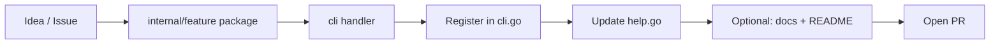

# Contributing to Nestify

Thanks for helping make Nestify better.

You can open an issue, suggest an idea, or implement a feature yourself.  
Either way: **be respectful**, keep changes focused, and **tell us what cool capability you added** so others can find and use it.

---

## Ways to contribute

| Path | When to use it |
|------|----------------|
| **Issue / feature request** | You have an idea or found a bug but cannot code it right now |
| **Pull request** | You implement the change in this repository |
| **Docs only** | Fix typos, clarify guides under `docs/` |

If you open a PR, a short description of **why** the feature exists is more useful than a wall of implementation detail.

---

## Project shape (quick map)

```text
cmd/nestify/main.go     → entrypoint, wires embedded templates into cli
internal/cli/           → subcommands, flags, user-facing messages
internal/<feature>/     → domain logic for that feature
templates-*/            → embedded ignore / project / prompt assets
docs/                   → MkDocs site
```

New capabilities almost always follow the same pattern already used by `scan`, `copy`, `init`, and the others.

---

## Adding a new command (standard path)

Yes — the usual approach is:

1. **Logic package** under `internal/` (e.g. `internal/myfeature/`)
2. **Handler** under `internal/cli/` (e.g. `myfeature.go` with `runMyFeatureCmd`)
3. **Register** the subcommand in `internal/cli/cli.go`
4. **Update** `internal/cli/help.go` (and docs when the feature is user-visible)



### Step-by-step

**1. Implement the behavior** in a dedicated package when the logic is non-trivial.  
Reuse existing pieces when they fit:

- Path handling → `internal/pathutil`
- Ignore rules → `internal/ignore`
- Tree models → `internal/types` / `internal/scanner`

**2. Add a CLI handler** in `internal/cli/`, similar to `scan.go` or `copy.go`:

- `flag.NewFlagSet("mycommand", …)`
- Parse flags after `os.Args[2:]`
- Call your package and print clear English status / error messages

**3. Register in `RunCli`** (`internal/cli/cli.go`):

```go
case "mycommand":
    runMyFeatureCmd()
```

**4. Document in `--help`** (`internal/cli/help.go`) so `nestify --help` stays accurate.

**5. (Recommended)** Add a page under `docs/commands/` and a line in `mkdocs.yml` / `docs/commands/overview.md` if users need more than a help line.

**6. Build and try it locally:**

```bash
go build -o nestify ./cmd/nestify
./nestify mycommand --help
```

---

## Templates without code changes

Ignore and prompt presets are loaded from the embedded filesystem by **filename**:

| Folder | Used by |
|--------|---------|
| `templates-ignore/*.txt` | `ignore-list` / `ignore-use` |
| `templates-prompts/*.txt` | `prompt-list` / `prompt` / `context -p` |
| `templates-projects/*.json` | `init --template` (and local paths) |

Add a file, reinstall (`go install ./cmd/nestify`), and the new name appears — no switch statement required for listing.

---

## Style expectations

- **User-facing messages and code comments in English** (keeps the upstream codebase consistent)
- Prefer **small, focused PRs** over giant refactors mixed with features
- Match existing patterns (flag sets, emoji status lines, `Nestify-Report/` for reports) unless you have a strong reason not to
- Do not add network calls or telemetry to core paths; Nestify is offline-first by design

---

## Pull request checklist

- [ ] Builds with `go build ./cmd/nestify`
- [ ] New subcommand registered in `cli.go` and listed in `help.go` (if applicable)
- [ ] Behavior respects `.nestifyignore` when the feature walks the tree (if applicable)
- [ ] Docs updated when the change is user-visible
- [ ] PR description states **what** you added and **why** it is useful

---

## Communication

- Be kind in issues and reviews. Disagreement is fine; contempt is not.
- Say clearly what you built or need — maintainers should not have to reverse-engineer your intent.
- If something is experimental, label it that way.

**Don't be an asshole.** Ship useful work, explain it briefly, and leave the project easier to understand than you found it.

---

## License

By contributing, you agree that your contributions are licensed under the same terms as the project (see `LICENSE` in the repository root).
