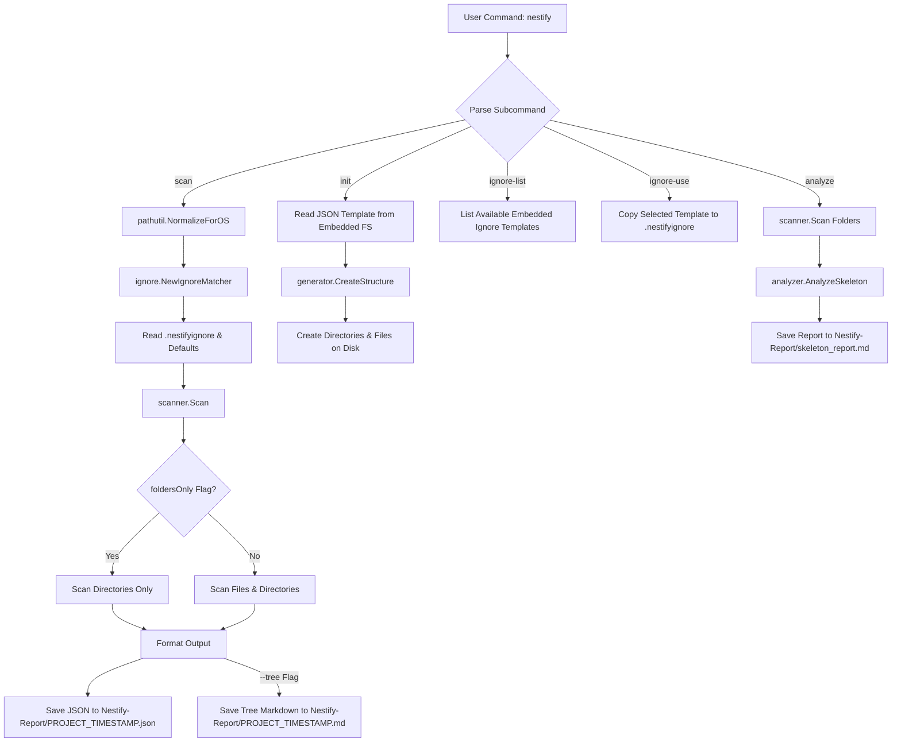

# Nestify

<p align="center">
  
  
  
  
</p>

**Nestify** is a fast, lightweight, and cross-platform command-line tool (CLI) written in Go that empowers developers to **scan**, **analyze**, and **generate** project folder structures effortlessly.

Whether you are working with Go, .NET, Node.js, Python, Flutter, React, or Unity projects, Nestify brings clarity and standardization to your development workflow.

---

## ❓ Why Nestify?

Modern developer tools are becoming bloated, cloud-dependent, and intrusive. Nestify takes the opposite path — a fast, private, offline-first toolkit for project analysis and AI contextualization.

- 🔒 **100% Local & Private:** Runs entirely on your machine with zero telemetry. Your codebase never leaves your system.
- ⚡ **Lightning-Fast, Single Binary:** Written in Go and compiled into one native executable. No Node.js, Python, or external runtimes.
- 🧠 **AI Token-Efficient Reports:** Automatically removes build noise (`bin/`, `obj/`, `node_modules/`) so you only send meaningful architecture context to LLMs.
- 🔄 **Full Architecture Lifecycle:** Scan → Analyze → Export JSON blueprint → Rebuild structure with `nestify init`. A complete round-trip workflow for developers.

---

## 🌟 Key Features

- 🌍 **Global Execution**  
  Install once and run `nestify` globally from any folder or project on your system.
- 📦 **Zero-Config Embedded Templates**  
  All ignore and project templates (`templates-ignore/`, `templates-projects/`) are embedded directly into the binary via Go's `embed` package.
- 🔍 **Smart Project Scanning**  
  Scans project directories and exports structured reports in both **JSON** and clean **Markdown Tree** formats.
- 📂 **Organized Report Output**  
  Automatically saves timestamped reports inside a designated `Nestify-Report/` folder in your working directory.
- 📁 **Folders-Only Mode (`--folders-only`)**  
  Focus on high-level architecture by stripping out file clutter in output reports.
- 🚫 **Built-in Ignore Templates (`ignore-list` & `ignore-use`)**  
  Manage filtering seamlessly using embedded `.nestifyignore` templates (e.g., Go, Node.js, Python, .NET, Flutter).
- 🧠 **Skeleton Analysis (`analyze`)**  
  Automatically evaluates directory layouts and detects folder roles (e.g., entry points, core logic, configs, tests).
- 🏗️ **Project Generation (`init`)**  
  Instantly bootstrap new project directory structures from JSON templates.

---

## 🔄 Program Workflow & Architecture

The diagram below illustrates how Nestify routes CLI commands and processes directory scans and template generation:



---

## ⚙️ Installation

### Global Installation (Recommended)

Ensure you have **Go 1.16+** installed on your system.

### 1. Clone the repository

```bash
git clone [https://github.com/badboy1981/Nestify.git](https://github.com/badboy1981/Nestify.git)
cd Nestify
```

### 2. Install globally

Executing this command compiles Nestify alongside all embedded templates and moves the executable binary directly into your system's `GOPATH/bin`:

```bash
go install ./cmd/nestify
```

> 💡 *Note:* Ensure your `GOPATH/bin` directory is added to your system's `PATH` environment variable.

---

## 🚀 Usage & Commands

You can execute `nestify` commands from **any working directory** on your computer.

### 1. Scan a Project (`scan`)

Scans a directory path and outputs structured representations into the `Nestify-Report/` directory.

```bash
nestify scan [options]
```

#### Flags:

* `--path <path>` : Path to the project directory (Default: `.`)
* `--tree` : Generates a readable tree-view Markdown file (`Nestify-Report/PROJECT_TIMESTAMP.md`)
* `--folders-only` : Excludes files from the scan to display only directory hierarchy

#### Examples:

##### 1. Full scan of the current directory with tree view (Default path)

When you are already inside the target project directory:

```bash
nestify scan --tree
```

OR

```bash
nestify scan --tree --folders-only
```

##### 2. Full scan of the current directory with tree view

```bash
nestify scan --path . --tree
```

##### 3. Scan only folder hierarchy of a specific project

```bash
nestify scan --path ./MyProject --tree --folders-only
```

---

### 2. Manage `.nestifyignore` Templates (`ignore-list` / `ignore-use`)

View and apply built-in ignore templates tailored for specific tech stacks without needing extra files.

#### List all available embedded ignore templates

```bash
nestify ignore-list
```

#### Apply the Go template to your current working directory

```bash
nestify ignore-use go
```

---

### 3. Analyze Project Skeleton & Languages (`analyze`)

Evaluates the project directory by applying `.nestifyignore` filtering, eliminating build artifacts (`bin/`, `obj/`, `node_modules/`), and calculating real source-code language distributions alongside project metrics.

```bash
nestify analyze [path]
```

#### What it produces:

It generates a concise report inside `Nestify-Report/skeleton_report.md` containing:

* **Clean Project Metrics:** Total physical size, real file counts, and folder depth (excluding ignored artifacts).
* **Language Percentage Breakdown:** Accurate visual progress bars showing source language ratios.
* **Prompt-Ready AI Summary:** A compact JSON block designed to be copied directly into LLMs (like Gemini or Claude) for instant codebase context.

#### Example Report Preview:

```markdown
# 🧠 Nestify Project Analysis Report

## 📊 Project Metrics
- **Total Size:** 37.65 KB
- **Total Files:** 28
- **Total Folders:** 16

## 🌐 Languages Breakdown
- **Go          ** `█████░░░░░`   55.9% (16 files, 21.1 KB)
- **Markdown    ** `███░░░░░░░`   38.8% (2 files, 14.6 KB)
- **JSON        ** `█░░░░░░░░░`    3.1% (2 files, 1.2 KB)
- **Other       ** `█░░░░░░░░░`    2.2% (2 files, 0.8 KB)
- **Text        ** `░░░░░░░░░░`    0.0% (6 files, 0.0 KB)

---
### 🤖 Prompt-Ready Summary for AI Analysis
```json
{
  "total_files": 28,
  "total_size_bytes": 38558,
  "top_languages": [
    {"language": "Go", "percentage": 55.9},
    {"language": "Markdown", "percentage": 38.8},
    {"language": "JSON", "percentage": 3.1},
    {"language": "Other", "percentage": 2.2},
    {"language": "Text", "percentage": 0.0}
  ]
}
```

### 4. Create Project from Template (`init`)

Generates a physical file/folder hierarchy from a JSON template.

```bash
nestify init --template templates-projects/go_standard.json --path ./MyNewApp
```

---

## 🛠️ Adding Custom Templates

Adding new ignore templates is fully dynamic and requires zero code modifications:

1. Drop a new `.txt` file into the `templates-ignore/` directory in your local clone (e.g., `templates-ignore/rust.txt`).
2. Reinstall the CLI:

```bash
go install ./cmd/nestify
```

3. Your new template is now embedded and immediately listed under `nestify ignore-list`!

---

## 🔄 Reusing Existing Project Architectures

You can easily capture the architecture of an existing project and use it as a blueprint for new ones:

1. **Scan the source project:**

```bash
nestify scan --path ./ExistingProject --folders-only
```

2. **Locate the generated JSON report** inside `Nestify-Report/`.
3. **Generate a new project structure from that report:**

```bash
nestify init --template Nestify-Report/ExistingProject_20260720_110010.json --path ./NewProject
```

---

## 📄 Real Example Outputs

### 1. Markdown Tree Output (`--tree`)

# Project Structure: Nestify

Generated by **Nestify** on 2026-07-20 13:30:40

```text
.
└── Nestify
    ├── .nestifyignore
    ├── NOTICE
    ├── README.md
    ├── README_fa.md
    ├── cmd
    │   └── nestify
    │       └── main.go
    ├── config
    ├── embed.go
    ├── internal
    │   ├── analyzer
    │   │   └── analyzer.go
    │   ├── cli
    │   │   ├── cli.go
    │   │   ├── help.go
    │   │   ├── ignore_handler.go
    │   │   ├── init.go
    │   │   ├── scan.go
    │   │   └── version.go
    │   ├── generator
    │   │   └── generator.go
    │   ├── ignore
    │   │   ├── ignore copy.txt
    │   │   └── ignore.go
    │   ├── pathutil
    │   │   └── pathutil.go
    │   ├── scanner
    │   │   └── scanner.go
    │   ├── treeprinter
    │   │   └── treeprinter.go
    │   └── types
    │       └── type.go
    ├── templates-ignore
    │   ├── dotnet.txt
    │   ├── flutter.txt
    │   ├── general.txt
    │   ├── go.txt
    │   ├── nodejs.txt
    │   └── python.txt
    └── templates-projects
        ├── go_basic.json
        └── go_standard.json

```

### 2. JSON Report Output (`Nestify-Report/*.json`)

```json
[
  {
    "name": "Nestify",
    "type": "folder",
    "size": 4096,
    "children": [
      {
        "name": ".nestifyignore",
        "type": "file",
        "size": 784
      },
      {
        "name": "cmd",
        "type": "folder",
        "children": [
          {
            "name": "nestify",
            "type": "folder",
            "children": [
              {
                "name": "main.go",
                "type": "file",
                "size": 119
              }
            ]
          }
        ]
      }
    ]
  }
]
```

---

## 🏛️ Codebase Architecture

The internal structure of Nestify follows standard Go project layout practices:

| Directory / Package | Responsibility |
| --- | --- |
| `embed.go` | Root embed definition holding global template file systems (`RootTemplatesFS`). |
| `cmd/nestify/` | Application entry point (`main.go`). |
| `internal/cli/` | Command-line argument parsing and subcommands (`scan`, `init`, `analyze`, `ignore-*`). |
| `internal/scanner/` | Recursive directory traversal and node hierarchy assembly. |
| `internal/ignore/` | `.nestifyignore` parsing, template retrieval, and pattern matching logic. |
| `internal/generator/` | Disk structure creation based on JSON node templates. |
| `internal/analyzer/` | Folder role detection heuristics (e.g., `cmd`, `internal`, `src`). |
| `internal/pathutil/` | Cross-platform file path normalization (Windows / Unix slashes). |
| `internal/treeprinter/` | Pretty-printed ASCII tree string builder. |
| `internal/types/` | Core struct definitions (`Node`, `Template`). |
| `templates-ignore/` | Embedded ignore rule templates. |
| `templates-projects/` | Embedded project scaffold templates. |

---

## 💻 CLI Command Reference Summary

| Command | Description | Example |
| --- | --- | --- |
| `nestify context` | Generates a unified, AI-ready report combining metrics, languages, and directory tree. | `nestify context` |
| `nestify analyze` | Evaluates project skeleton metrics and language breakdowns. | `nestify analyze [path]` |
| `nestify scan` | Scans directory structures and exports JSON/Markdown tree reports. | `nestify scan --path . --tree` |
| `nestify init` | Scaffolds physical project directories and files from a JSON template. | `nestify init --template Blueprint.json --path ./App` |
| `nestify ignore-use` | Applies a built-in ignore template to clean out unwanted build artifacts. | `nestify ignore-use go` |
| `nestify ignore-list` | Lists all available embedded tech-stack ignore templates. | `nestify ignore-list` |

---

## 💡 Real-World Use Cases

Nestify is designed for modern development workflows. Below are the primary scenarios where it shines:

### 1. ⚡ Quick Standard Workflow (Daily Scanning & Analysis)

The most common and effortless way to use Nestify inside any project directory:

1. **Navigate to your project root:**

```bash
cd ./MyProject
```

2. **Clean Noise (Apply Ignore Template):**
Strip out compiled artifacts, dependencies, and temporary files (`bin/`, `obj/`, `node_modules/`, `dist/`):

```bash
nestify ignore-use dotnet   # or go, nodejs, python, flutter, etc.

```

3. **Run your desired operation:**

* **For AI Prompts:** Generate a complete metrics + tree context report:

```bash
nestify context
```

* **For Folder Architecture Analysis:** Get visual language statistics:

```bash
nestify analyze
```

* **For Structured JSON Output (Default):**

```bash
nestify scan
```

* **For Visual Markdown Tree:**

```bash
nestify scan --tree
```

* **For Folder-Only Hierarchy (Clean Architecture View):**

```bash
nestify scan --tree --folders-only
```

OR

```bash
nestify scan --folders-only
```

---

### 2. 🤖 AI-Driven Codebase Context Generation (Prompt Engineering)

When requesting AI models (Gemini, ChatGPT, Claude) to refactor, audit, or review a codebase:

* **Step 1: Eliminate Noise (CRITICAL)**
Unfiltered scans include build artifacts, which corrupt metrics and waste LLM token limits. **Always apply ignore filtering first**:

```bash
nestify ignore-use dotnet   # or go, nodejs, python, etc.
```

* **Step 2: Generate AI-Ready Context Report**
Run the unified context command:

```bash
nestify context
```

> 📄 *Output:* Generates `Nestify-Report/ai_context_report.md` combining **skeleton metrics, real language breakdown, and clean directory tree** ready to be attached to your AI prompts.

---

### 3. 🏗️ Architectural Reverse-Engineering (GitHub to Local Scaffold)

Replicate the clean directory blueprint of a popular open-source GitHub repository without copying source code or build clutter:

1. **Step 1: Clean Noise**
Apply ignore filtering to exclude build outputs:

```bash
nestify ignore-use go
```

2. **Step 2: Scan Folder Structure Only**

```bash
nestify scan --folders-only
```

3. **Step 3: Re-create the empty scaffold locally**

```bash
nestify init --template Nestify-Report/FamousRepo_20260720_120000.json --path ./MyNewCleanProject
```

---

## 📄 License & Attribution

This project is licensed under the **Apache License 2.0**. See the [LICENSE](https://github.com/badboy1981/Nestify/blob/main/LICENSE) file for full details.

Copyright © 2026 **[badboy1981](https://github.com/badboy1981)**