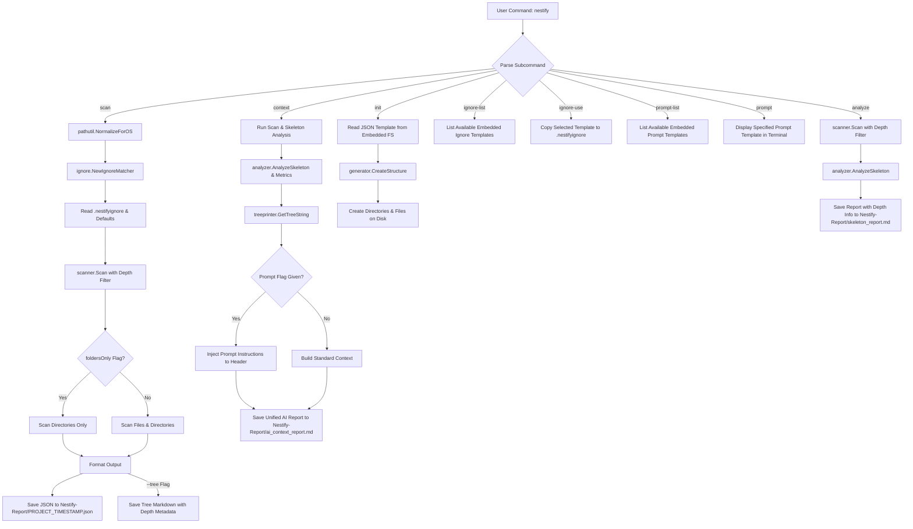

# Nestify

<p align="center">
  
  
  
  
</p>

**Nestify** is a fast, lightweight, and cross-platform command-line tool (CLI) written in Go that empowers developers to **scan**, **analyze**, and **generate** project folder structures effortlessly.

Whether you are working with Go, .NET, Node.js, Python, Flutter, React, or Unity projects, Nestify brings clarity and standardization to your development workflow.

---

## ❓ Why Nestify?

Modern developer tools are becoming bloated, cloud-dependent, and intrusive. Nestify takes the opposite path — a fast, private, offline-first toolkit for project analysis and AI contextualization.

- 🔒 **100% Local & Private:** Runs entirely on your machine with zero telemetry. Your codebase never leaves your system.
- ⚡ **Lightning-Fast, Single Binary:** Written in Go and compiled into one native executable. No Node.js, Python, or external runtimes.
- 🧠 **AI Token-Efficient Reports:** Automatically removes build noise (`bin/`, `obj/`, `node_modules/`) so you only send meaningful architecture context to LLMs.
- 💬 **Injected Prompt Templates:** Attach targeted AI instructions (architecture, refactoring, security audits) directly into your context reports.
- 📏 **Custom Traversal Depth (`--depth` / `-d`):** Limit scan depth to focus on high-level architecture without drowning in nested folders.
- 🔄 **Full Architecture Lifecycle:** Scan → Analyze → Export JSON blueprint → Rebuild structure with `nestify init`. A complete round-trip workflow for developers.

---

## 🌟 Key Features

- 🌍 **Global Execution**  
  Install once and run `nestify` globally from any folder or project on your system.
- 📦 **Zero-Config Embedded Templates**  
  All ignore, project, and prompt templates (`templates-ignore/`, `templates-projects/`, `templates-prompts/`) are embedded directly into the binary via Go's `embed` package.
- 💬 **Prompt Engineering Integration (`-p` / `--prompt`)**  
  Inject pre-built prompt templates or custom LLM task instructions directly into generated AI context reports.
- 📏 **Directory Depth Control (`-d` / `--depth`)**  
  Restrict directory recursion to specific levels for quick top-level architectural overviews.
- 🔍 **Smart Project Scanning**  
  Scans project directories and exports structured reports in both **JSON** and clean **Markdown Tree** formats.
- 📂 **Organized Report Output**  
  Automatically saves timestamped reports inside a designated `Nestify-Report/` folder in your working directory.
- 📁 **Folders-Only Mode (`--folders-only`)**  
  Focus on high-level architecture by stripping out file clutter in output reports.
- 🚫 **Built-in Ignore Templates (`ignore-list` & `ignore-use`)**  
  Manage filtering seamlessly using embedded `.nestifyignore` templates (e.g., Go, Node.js, Python, .NET, Flutter).
- 🧠 **Skeleton Analysis (`analyze`)**  
  Automatically evaluates directory layouts and detects folder roles (e.g., entry points, core logic, configs, tests).
- 🏗️ **Project Generation (`init`)**  
  Instantly bootstrap new project directory structures from JSON templates.

---

## 🔄 Program Workflow & Architecture

The diagram below illustrates how Nestify routes CLI commands and processes directory scans, AI context generation, and template management:


```mermaid
graph TD
    A[User Command: nestify] --> B{Parse Subcommand}

    %% SCAN COMMAND FLOW
    B -->|scan| C[pathutil.NormalizeForOS]
    C --> D[ignore.NewIgnoreMatcher]
    D --> E[Read .nestifyignore & Defaults]
    E --> F[scanner.Scan with Depth Filter]
    F --> G{foldersOnly Flag?}
    G -->|Yes| H[Scan Directories Only]
    G -->|No| I[Scan Files & Directories]
    H --> J[Format Output]
    I --> J
    J --> K[Save JSON to Nestify-Report/PROJECT_TIMESTAMP.json]
    J -->|--tree Flag| L[Save Tree Markdown with Depth Metadata]

    %% CONTEXT COMMAND FLOW
    B -->|context| M[Run Scan & Skeleton Analysis]
    M --> N[analyzer.AnalyzeSkeleton & Metrics]
    N --> O[treeprinter.GetTreeString]
    O --> P{Prompt Flag Given?}
    P -->|Yes| Q[Inject Prompt Instructions to Header]
    P -->|No| R[Build Standard Context]
    Q --> S[Save Unified AI Report to Nestify-Report/ai_context_report.md]
    R --> S

    %% INIT COMMAND FLOW
    B -->|init| T[Read JSON Template from Embedded FS]
    T --> U[generator.CreateStructure]
    U --> V[Create Directories & Files on Disk]

    %% IGNORE COMMAND FLOW
    B -->|ignore-list| W[List Available Embedded Ignore Templates]
    B -->|ignore-use| X[Copy Selected Template to .nestifyignore]

    %% PROMPT COMMAND FLOW
    B -->|prompt-list| Y[List Available Embedded Prompt Templates]
    B -->|prompt| Z[Display Specified Prompt Template in Terminal]

    %% ANALYZE COMMAND FLOW
    B -->|analyze| AA[scanner.Scan with Depth Filter]
    AA --> AB[analyzer.AnalyzeSkeleton]
    AB --> AC[Save Report with Depth Info to Nestify-Report/skeleton_report.md]
```

---

## ⚙️ Installation

### Global Installation (Recommended)

Ensure you have **Go 1.16+** installed on your system.

### 1. Clone the repository

```bash
git clone [https://github.com/badboy1981/Nestify.git](https://github.com/badboy1981/Nestify.git)
cd Nestify
```

### 2. Install globally

Executing this command compiles Nestify alongside all embedded templates and moves the executable binary directly into your system's `GOPATH/bin`:

```bash
go install ./cmd/nestify
```

> 💡 *Note:* Ensure your `GOPATH/bin` directory is added to your system's `PATH` environment variable.

---

## 🚀 Usage & Commands

You can execute `nestify` commands from **any working directory** on your computer.

### 1. AI Context Generation (`context`)

Generates a unified Markdown report (`Nestify-Report/ai_context_report.md`) combining project metrics, language distributions, directory structure, and optional AI task instructions.

```bash
nestify context [options]
```

#### Flags:

* `-p, --prompt <template|text>` : Inject an embedded prompt template (e.g., `architecture`, `refactor`) or custom instruction text into the report header.
* `-d, --depth <int>` : Limit directory traversal depth (e.g., `-d 2`). Default: `0` (unlimited).
* `--path <path>` : Target project path (Default: `.`).

#### Examples:

##### Generate AI context with default scan depth

```bash
nestify context
```

##### Inject an embedded prompt template (`architecture`) with scan depth restricted to 2 levels

```bash
nestify context -p architecture -d 2
```

##### Inject custom prompt text directly from the terminal

```bash
nestify context -p "Review this codebase structure for Go clean architecture guidelines" -d 3
```

---

### 2. Manage Prompt Templates (`prompt-list` / `prompt`)

View and inspect built-in prompt templates designed for AI codebase evaluation.

#### List all available embedded prompt templates

```bash
nestify prompt-list
```

#### View the full text of a specific prompt template

```bash
nestify prompt architecture
```

---

### 3. Scan a Project (`scan`)

Scans a directory path and outputs structured representations into the `Nestify-Report/` directory.

```bash
nestify scan [options]
```

#### Flags:

* `--path <path>` : Path to the project directory (Default: `.`)
* `--tree` : Generates a readable tree-view Markdown file (`Nestify-Report/PROJECT_TIMESTAMP.md`)
* `--folders-only` : Excludes files from the scan to display only directory hierarchy
* `-d, --depth <int>` : Limit scan depth (Default: `0` / unlimited)

#### Examples:

##### Full scan with tree view up to 2 folder levels deep

```bash
nestify scan -d 2 --tree
```

##### Scan folder hierarchy only up to depth level 1

```bash
nestify scan --folders-only -d 1
```

---

### 4. Manage `.nestifyignore` Templates (`ignore-list` / `ignore-use`)

View and apply built-in ignore templates tailored for specific tech stacks without needing extra files.

#### List all available embedded ignore templates

```bash
nestify ignore-list
```

#### Apply the Go template to your current working directory

```bash
nestify ignore-use go
```

---

### 5. Analyze Project Skeleton & Languages (`analyze`)

Evaluates the project directory by applying `.nestifyignore` filtering, eliminating build artifacts (`bin/`, `obj/`, `node_modules/`), and calculating real source-code language distributions alongside project metrics.

```bash
nestify analyze [options]
```

#### Flags:

* `-d, --depth <int>` : Limit analysis depth.

#### Example Report Preview:


> **Scan Depth:** 2

# 🧠 Nestify Project Analysis Report

## 📊 Project Metrics
- **Total Size:** 37.65 KB
- **Total Files:** 28
- **Total Folders:** 16

## 🌐 Languages Breakdown
- **Go          ** `█████░░░░░`   55.9% (16 files, 21.1 KB)
- **Markdown    ** `███░░░░░░░`   38.8% (2 files, 14.6 KB)
- **JSON        ** `█░░░░░░░░░`    3.1% (2 files, 1.2 KB)
- **Other       ** `█░░░░░░░░░`    2.2% (2 files, 0.8 KB)
- **Text        ** `░░░░░░░░░░`    0.0% (6 files, 0.0 KB)

---
### 🤖 Prompt-Ready Summary for AI Analysis
```json
{
  "total_files": 28,
  "total_size_bytes": 38558,
  "top_languages": [
    {"language": "Go", "percentage": 55.9},
    {"language": "Markdown", "percentage": 38.8},
    {"language": "JSON", "percentage": 3.1},
    {"language": "Other", "percentage": 2.2},
    {"language": "Text", "percentage": 0.0}
  ]
}
```

---

### 6. Create Project from Template (`init`)

Generates a physical file/folder hierarchy from a JSON template.

```bash
nestify init --template templates-projects/go_standard.json --path ./MyNewApp
```

---

## 🛠️ Adding Custom Templates

Adding new ignore, project, or prompt templates is fully dynamic and requires zero code modifications:

1. Drop a new `.txt` file into `templates-ignore/` or `templates-prompts/` in your local clone (e.g., `templates-prompts/custom-audit.txt`).
2. Reinstall the CLI:

```bash
go install ./cmd/nestify
```

3. Your new template is now embedded and immediately available via `nestify prompt-list` or `nestify ignore-list`!
---

## 🔄 Reusing Existing Project Architectures

You can easily capture the architecture of an existing project and use it as a blueprint for new ones:

1. **Scan the source project:**

```bash
nestify scan --path ./ExistingProject --folders-only
```

2. **Locate the generated JSON report** inside `Nestify-Report/`.
3. **Generate a new project structure from that report:**

```bash
nestify init --template Nestify-Report/ExistingProject_20260720_110010.json --path ./NewProject
```

---

## 📄 Real Example Outputs

### AI Context Report Output with Injected Prompt (`ai_context_report.md`)


# 💬 AI Task & Instructions

You are an enterprise software architect experienced in Clean Architecture, Onion Architecture, and Event-Driven systems.
Evaluate the directory and module structure of this project.
Verify layer separation (Domain, Application, Infrastructure, Presentation), check for dependency inversion violations, and suggest structural corrections to strictly maintain architectural boundaries.

---

# 🤖 Project Context for AI Analysis

Generated by **Nestify** on 2026-08-04 20:35:42 | **Scan Depth:** 2

## 📊 Project Metrics
- **Total Size:** 42.10 KB
- **Total Files:** 32
- **Total Folders:** 18

## 🌐 Languages Breakdown
- **Go          ** `██████░░░░`   62.5% (20 files, 26.3 KB)
- **Markdown    ** `███░░░░░░░`   30.1% (4 files, 12.7 KB)
- **JSON        ** `█░░░░░░░░░`    7.4% (8 files, 3.1 KB)

---

## 🌲 Project Directory Tree

```text
.
└── Nestify
    ├── LICENSE
    ├── cmd
    │   └── nestify
    │       └── main.go
    ├── embed.go
    ├── internal
    │   ├── analyzer
    │   │   └── analyzer.go
    │   ├── cli
    │   │   ├── analyze_handler.go
    │   │   ├── cli.go
    │   │   ├── context_handler.go
    │   │   ├── help.go
    │   │   ├── ignore_handler.go
    │   │   ├── init.go
    │   │   ├── prompt_handler.go
    │   │   ├── scan.go
    │   │   └── version.go
    │   ├── generator
    │   │   └── generator.go
    │   ├── ignore
    │   │   └── ignore.go
    │   ├── pathutil
    │   │   └── pathutil.go
    │   ├── scanner
    │   │   └── scanner.go
    │   ├── treeprinter
    │   │   └── treeprinter.go
    │   └── types
    │       └── type.go
    ├── templates-ignore
    │   ├── angular.txt
    │   ├── docker.txt
    │   ├── dotnet.txt
    │   ├── flutter.txt
    │   ├── general.txt
    │   ├── go.txt
    │   ├── java.txt
    │   ├── kotlin.txt
    │   ├── nodejs.txt
    │   ├── php-laravel.txt
    │   ├── python.txt
    │   ├── react.txt
    │   ├── ruby.txt
    │   ├── rust.txt
    │   ├── swift.txt
    │   ├── terraform.txt
    │   ├── unity.txt
    │   └── vue.txt
    ├── templates-projects
    │   ├── go_basic.json
    │   └── go_standard.json
    └── templates-prompts
        ├── architecture.txt
        ├── default.txt
        ├── desktop.txt
        ├── refactor.txt
        └── security.txt
```

---

## 🏛️ Codebase Architecture

The internal structure of Nestify follows standard Go project layout practices:

| Directory / Package | Responsibility |
| --- | --- |
| `embed.go` | Root embed definition holding global template file systems (`RootTemplatesFS`). |
| `cmd/nestify/` | Application entry point (`main.go`). |
| `internal/cli/` | Command-line argument parsing, flag routing, and subcommand handlers (`scan`, `context`, `analyze`, `prompt-*`, `ignore-*`). |
| `internal/scanner/` | Recursive directory traversal with depth limiting and node hierarchy assembly. |
| `internal/ignore/` | `.nestifyignore` parsing, embedded ignore templates, and pattern matching logic. |
| `internal/generator/` | Disk structure creation based on JSON node templates. |
| `internal/analyzer/` | Language detection heuristics and metric statistics calculation. |
| `internal/pathutil/` | Cross-platform file path normalization (Windows / Unix slashes). |
| `internal/treeprinter/` | Pretty-printed ASCII tree string builder. |
| `internal/types/` | Core struct definitions (`Node`, `Template`). |
| `templates-ignore/` | Embedded ignore rule templates. |
| `templates-projects/` | Embedded project scaffold templates. |
| `templates-prompts/` | Embedded prompt templates for LLM instruction injection. |

---

## 💻 CLI Command Reference Summary

| Command | Description | Example |
| --- | --- | --- |
| `nestify context` | Generates a unified, AI-ready report with optional prompt injection (`-p`) and depth limits (`-d`). | `nestify context -p architecture -d 2` |
| `nestify prompt-list` | Lists all available embedded prompt templates. | `nestify prompt-list` |
| `nestify prompt` | Displays the content of a specific prompt template in the terminal. | `nestify prompt architecture` |
| `nestify analyze` | Evaluates project skeleton metrics and language breakdowns. | `nestify analyze -d 2` |
| `nestify scan` | Scans directory structures and exports JSON/Markdown tree reports. | `nestify scan -d 2 --tree` |
| `nestify init` | Scaffolds physical project directories and files from a JSON template. | `nestify init --template Blueprint.json --path ./App` |
| `nestify ignore-use` | Applies a built-in ignore template to clean out unwanted build artifacts. | `nestify ignore-use go` |
| `nestify ignore-list` | Lists all available embedded tech-stack ignore templates. | `nestify ignore-list` |
---

## 💡 Real-World Use Cases

Nestify is designed for modern development workflows. Below are the primary scenarios where it shines:

### 1. ⚡ Quick Standard Workflow (Daily Scanning & Analysis)

The most common and effortless way to use Nestify inside any project directory:

1. **Navigate to your project root:**

```bash
cd ./MyProject
```

2. **Clean Noise (Apply Ignore Template):**
Strip out compiled artifacts, dependencies, and temporary files (`bin/`, `obj/`, `node_modules/`, `dist/`):

```bash
nestify ignore-use dotnet   # or go, nodejs, python, flutter, etc.
```

3. **Run your desired operation:**

* **For AI Prompts:** Generate a complete metrics + tree context report with injected prompt instructions:

```bash
nestify context -p architecture -d 2
```

* **For Folder Architecture Analysis:** Get visual language statistics:

```bash
nestify analyze
```

* **For Structured JSON Output (Default):**

```bash
nestify scan
```

* **For Visual Markdown Tree:**

```bash
nestify scan --tree
```

* **For Folder-Only Hierarchy (Clean Architecture View):**

```bash
nestify scan --tree --folders-only
```

---

### 2. 🤖 AI-Driven Codebase Context Generation (Prompt Engineering)

When requesting AI models (Gemini, ChatGPT, Claude) to refactor, audit, or review a codebase:

* **Step 1: Eliminate Noise (CRITICAL)**
Unfiltered scans include build artifacts, which corrupt metrics and waste LLM token limits. **Always apply ignore filtering first**:

```bash
nestify ignore-use dotnet   # or go, nodejs, python, etc.
```

* **Step 2: Generate AI-Ready Context Report with Targeted Prompt Instructions**
Run the unified context command with a prompt template and depth constraint:

```bash
nestify context -p refactor -d 3
```

> 📄 *Output:* Generates `Nestify-Report/ai_context_report.md` combining **prompt instructions, skeleton metrics, real language breakdown, and depth-restricted directory tree** ready to be attached to your AI prompts.
---

### 3. 🏗️ Architectural Reverse-Engineering (GitHub to Local Scaffold)

Replicate the clean directory blueprint of a popular open-source GitHub repository without copying source code or build clutter:

1. **Step 1: Clean Noise**
Apply ignore filtering to exclude build outputs:

```bash
nestify ignore-use go
```

2. **Step 2: Scan Folder Structure Only**

```bash
nestify scan --folders-only -d 2
```

3. **Step 3: Re-create the empty scaffold locally**

```bash
nestify init --template Nestify-Report/FamousRepo_20260720_120000.json --path ./MyNewCleanProject
```

---

## 📄 License & Attribution

This project is licensed under the **Apache License 2.0**. See the [LICENSE](https://github.com/badboy1981/Nestify/blob/main/LICENSE) file for full details.

Copyright © 2026 **[badboy1981](https://github.com/badboy1981)**