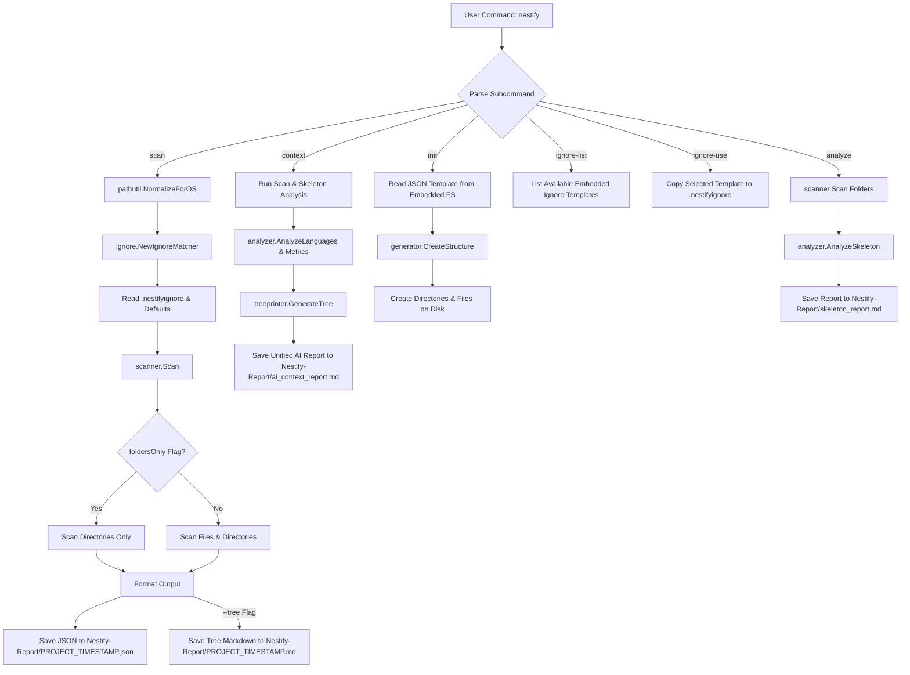

# Nestify

<p align="center">
  
  
  
  
</p>

ا **Nestify** یک ابزار خط فرمان (CLI) سریع، سبک و چندپلتفرمی است که با زبان Go نوشته شده و به توسعه‌دهندگان کمک می‌کند تا ساختار پوشه‌های پروژه خود را به‌راحتی **اسکن**، **تحلیل** و **تولید** کنند.

چه با پروژه‌های Go، .NET، Node.js، Python، Flutter، React یا Unity کار کنید، Nestify شفافیت و استانداردسازی را به جریان کاری توسعه شما می‌آورد.

---

## ❓ چرا Nestify؟

ابزارهای امروزی توسعه‌دهندگان در حال سنگین‌تر شدن، وابسته شدن به فضای ابری و تهاجمی‌تر شدن هستند. Nestify مسیر معکوسی را در پیش گرفته است — یک جعبه‌ابزار سریع، خصوصی و آفلاین (Offline-first) برای تحلیل پروژه و زمینه‌سازی (Contextualization) برای هوش مصنوعی.

- 🔒 **۱۰۰٪ محلی و خصوصی:** کاملاً روی سیستم شما اجرا می‌شود و هیچ‌گونه تلمتری یا ارسال داده‌ای ندارد. سورس‌کد شما هرگز از سیستمتان خارج نمی‌شود.
- ⚡ **سریع و فایل اجرایی تک‌فایلی:** با Go نوشته شده و به یک فایل اجرایی نیتیو کامپایل شده است. بدون نیاز به Node.js، Python یا پلتفرم‌های اجرا (Runtimes) جانبی.
- 🧠 **گزارش‌های بهینه برای مصرف توکن AI:** به‌طور خودکار فایل‌های اضافی ساخت پروژه (`bin/`، `obj/`، `node_modules/`) را حذف می‌کند تا فقط زمینه معماری باارزش را بدون هدر دادن توکن به مدل‌های زبانی ارسال کنید.
- 🔄 **چرخه کامل معماری:** اسکن ← تحلیل ← خروجی نقشه JSON ← ساخت مجدد ساختار با دستور `nestify init`. یک جریان کاری کامل و دوطرفه برای توسعه‌دهندگان.

---

## 🌟 ویژگی‌های کلیدی

- 🌍 **اجرای سراسری (Global)**  
  یک‌بار نصب کنید و `nestify` را به‌صورت سراسری از هر پوشه یا پروژه‌ای روی سیستم خود اجرا کنید.
- 📦 **قالب‌های تعبیه‌شده بدون نیاز به پیکربندی**  
  تمام قالب‌های نادیده‌گیری (Ignore) و پروژه‌ها (`templates-ignore/` و `templates-projects/`) مستقیماً از طریق پکیج `embed` زبان Go درون فایل اجرایی قرار گرفته‌اند.
- 🔍 **اسکن هوشمند پروژه**  
  پوشه‌های پروژه را اسکن کرده و گزارش‌های ساختاریافته را در قالب **JSON** و درخت شفاف **Markdown** خروجی می‌دهد.
- 📂 **خروجی‌های منظم گزارش**  
  گزارش‌ها را همراه با برچسب زمانی به‌طور خودکار درون پوشه اختصاصی `Nestify-Report/` در مسیر فعلی ذخیره می‌کند.
- 📁 **حالت فقط-پوشه (`--folders-only`)**  
  با حذف فایل‌های اضافی در گزارش‌های خروجی، تمرکز خود را روی معماری سطح بالا قرار دهید.
- 🚫 **قالب‌های نادیده‌گیری داخلی (`ignore-list` و `ignore-use`)**  
  مدیریت فیلترها را با استفاده از قالب‌های تعبیه‌شده `.nestifyignore` (مانند Go, Node.js, Python, .NET, Flutter) به‌راحتی انجام دهید.
- 🧠 **تحلیل اسکلت پروژه (`analyze`)**  
  ساختار پوشه‌ها را به‌طور خودکار ارزیابی کرده و نقش پوشه‌ها را تشخیص می‌دهد (مانند نقاط ورود، منطق اصلی، تنظیمات، تست‌ها).
- 🏗️ **تولید پروژه (`init`)**  
  ساختار پوشه‌ها و فایل‌های یک پروژه جدید را بلافاصله از روی قالب‌های JSON پیاده‌سازی کنید.

---

## 🔄 جریان کاری و معماری برنامه

نمودار زیر نحوه مسیریابی دستورات CLI و پردازش اسکن پوشه‌ها و تولید قالب‌ها در Nestify را نشان می‌دهد:



---

## ⚙️ نحوه نصب

### نصب سراسری (پیشنهادی)

اطمینان حاصل کنید که **Go 1.16+** روی سیستم شما نصب است.

### ۱. کلون کردن ریپازیتوری

```bash
git clone [https://github.com/badboy1981/Nestify.git](https://github.com/badboy1981/Nestify.git)
cd Nestify
```

### ۲. نصب سراسری

اجرای این دستور، Nestify را به همراه تمام قالب‌های تعبیه‌شده کامپایل کرده و فایل اجرایی را مستقیماً به پوشه `GOPATH/bin` سیستم شما منتقل می‌کند:

```bash
go install ./cmd/nestify
```

> 💡 *نکته:* مطمئن شوید که مسیر `GOPATH/bin` به متغیر محیطی `PATH` در سیستم شما اضافه شده باشد.

---

## 🚀 نحوه استفاده و دستورات

شما می‌توانید دستورات `nestify` را از **هر پوشه کاری** در کامپیوتر خود اجرا کنید.

### ۱. اسکن پروژه (`scan`)

مسیر یک پوشه را اسکن کرده و خروجی‌های ساختاریافته را درون پوشه `Nestify-Report/` ذخیره می‌کند.

```bash
nestify scan [options]
```

#### پرچم‌ها (Flags):

* ا `--path <path>` : مسیر پوشه پروژه (پیش‌فرض: `.`)
* ا `--tree` : یک فایل Markdown با نمای درختی خوانا تولید می‌کند (`Nestify-Report/PROJECT_TIMESTAMP.md`)
* ا `--folders-only` : فایل‌ها را از اسکن حذف کرده و فقط ساختار پوشه‌ها را نمایش می‌دهد

#### مثال‌ها:

##### ۱. اسکن کامل پوشه فعلی با نمای درختی (مسیر پیش‌فرض)

وقتی از قبل داخل پوشه پروژه مورد نظر هستید:

```bash
nestify scan --tree
```

یا

```bash
nestify scan --tree --folders-only
```

##### ۲. اسکن کامل پوشه فعلی با نمای درختی

```bash
nestify scan --path . --tree
```

##### ۳. اسکن فقط ساختار پوشه‌های یک پروژه خاص

```bash
nestify scan --path ./MyProject --tree --folders-only
```

---

### ۲. مدیریت قالب‌های `.nestifyignore` (`ignore-list` / `ignore-use`)

قالب‌های نادیده‌گیری داخلی که برای تکنولوژی‌های مختلف آماده شده‌اند را بدون نیاز به فایل‌های اضافی مشاهده و اعمال کنید.

#### لیست کردن تمام قالب‌های نادیده‌گیری تعبیه‌شده

```bash
nestify ignore-list
```

#### اعمال قالب زبان Go روی پوشه کاری فعلی

```bash
nestify ignore-use go
```

---

### ۳. تحلیل اسکلت و زبان‌های پروژه (`analyze`)

پوشه پروژه را با اعمال فیلترهای `.nestifyignore` ارزیابی کرده، فایل‌های اضافی ساخت (`bin/`، `obj/`، `node_modules/`) را حذف می‌کند و توزیع واقعی زبان‌های سورس‌کد را به همراه متریک‌های پروژه محاسبه می‌نماید.

```bash
nestify analyze [path]
```

#### چه چیزی تولید می‌کند:

یک گزارش خلاصه درون فایل `Nestify-Report/skeleton_report.md` تولید می‌کند که شامل موارد زیر است:

* **متریک‌های شفاف پروژه:** حجم واقعی روی دیسک، تعداد واقعی فایل‌ها و عمق پوشه‌ها (بدون احتساب فایل‌های نادیده‌گرفته‌شده).
* **تفکیک درصدی زبان‌ها:** نوارهای پیشرفت بصری و دقیق که درصد استفاده از زبان‌های برنامه‌نویسی را نشان می‌دهند.
* **خلاصه آماده برای پرومپت AI:** یک بلاک JSON فشرده که طراحی شده تا مستقیماً درون مدل‌های هوش مصنوعی (مثل Gemini یا Claude) کپی شود.

#### پیش‌نمایش نمونه گزارش:

```markdown
# 🧠 Nestify Project Analysis Report

## 📊 Project Metrics
- **Total Size:** 37.65 KB
- **Total Files:** 28
- **Total Folders:** 16

## 🌐 Languages Breakdown
- **Go          ** `█████░░░░░`   55.9% (16 files, 21.1 KB)
- **Markdown    ** `███░░░░░░░`   38.8% (2 files, 14.6 KB)
- **JSON        ** `█░░░░░░░░░`    3.1% (2 files, 1.2 KB)
- **Other       ** `█░░░░░░░░░`    2.2% (2 files, 0.8 KB)
- **Text        ** `░░░░░░░░░░`    0.0% (6 files, 0.0 KB)

---
### 🤖 Prompt-Ready Summary for AI Analysis
```json
{
  "total_files": 28,
  "total_size_bytes": 38558,
  "top_languages": [
    {"language": "Go", "percentage": 55.9},
    {"language": "Markdown", "percentage": 38.8},
    {"language": "JSON", "percentage": 3.1},
    {"language": "Other", "percentage": 2.2},
    {"language": "Text", "percentage": 0.0}
  ]
}
```

### ۴. ساخت پروژه از روی قالب (`init`)

ساختار فیزیکی فایل‌ها و پوشه‌ها را از روی یک قالب JSON روی دیسک ایجاد می‌کند.

```bash
nestify init --template templates-projects/go_standard.json --path ./MyNewApp
```

---

## 🛠️ افزودن قالب‌های سفارشی

افزودن قالب‌های نادیده‌گیری جدید کاملاً پویا است و به هیچ تغییر کدی نیاز ندارد:

۱. یک فایل `.txt` جدید درون پوشه `templates-ignore/` در نسخه محلی خود قرار دهید (مثلاً `templates-ignore/rust.txt`).
۲. برنامه CLI را مجدداً نصب کنید:

```bash
go install ./cmd/nestify
```

۳. قالب جدید شما اکنون تعبیه شده و بلافاصله در دستور `nestify ignore-list` قرار می‌گیرد!

---

## 🔄 استفاده مجدد از معماری پروژه‌های موجود

شما می‌توانید به‌راحتی معماری یک پروژه موجود را استخراج کرده و از آن به‌عنوان نقشه راه برای پروژه‌های جدید استفاده کنید:

۱. **اسکن پروژه مبدا:**

```bash
nestify scan --path ./ExistingProject --folders-only
```

۲. **پیدا کردن گزارش JSON تولیدشده** درون پوشه `Nestify-Report/`.
۳. **تولید ساختار پروژه جدید از روی آن گزارش:**

```bash
nestify init --template Nestify-Report/ExistingProject_20260720_110010.json --path ./NewProject
```

---

## 📄 نمونه خروجی‌های واقعی

### ۱. خروجی درختی Markdown (`--tree`)

# Project Structure: Nestify

Generated by **Nestify** on 2026-07-20 13:30:40

```text
.
└── Nestify
    ├── .nestifyignore
    ├── NOTICE
    ├── README.md
    ├── README_fa.md
    ├── cmd
    │   └── nestify
    │       └── main.go
    ├── config
    ├── embed.go
    ├── internal
    │   ├── analyzer
    │   │   └── analyzer.go
    │   ├── cli
    │   │   ├── cli.go
    │   │   ├── help.go
    │   │   ├── ignore_handler.go
    │   │   ├── init.go
    │   │   ├── scan.go
    │   │   └── version.go
    │   ├── generator
    │   │   └── generator.go
    │   ├── ignore
    │   │   ├── ignore copy.txt
    │   │   └── ignore.go
    │   ├── pathutil
    │   │   └── pathutil.go
    │   ├── scanner
    │   │   └── scanner.go
    │   ├── treeprinter
    │   │   └── treeprinter.go
    │   └── types
    │       └── type.go
    ├── templates-ignore
    │   ├── dotnet.txt
    │   ├── flutter.txt
    │   ├── general.txt
    │   ├── go.txt
    │   ├── nodejs.txt
    │   └── python.txt
    └── templates-projects
        ├── go_basic.json
        └── go_standard.json

```

### ۲. خروجی گزارش JSON (`Nestify-Report/*.json`)

```json
[
  {
    "name": "Nestify",
    "type": "folder",
    "size": 4096,
    "children": [
      {
        "name": ".nestifyignore",
        "type": "file",
        "size": 784
      },
      {
        "name": "cmd",
        "type": "folder",
        "children": [
          {
            "name": "nestify",
            "type": "folder",
            "children": [
              {
                "name": "main.go",
                "type": "file",
                "size": 119
              }
            ]
          }
        ]
      }
    ]
  }
]
```

---

## 🏛️ معماری سورس‌کد

ساختار داخلی Nestify از استانداردهای رایج پروژه‌های Go پیروی می‌کند:

| پوشه / پکیج | مسئولیت |
| --- | --- |
| `embed.go` | تعریف ریشه embed که فایل‌سیستم‌های قالب‌ها را نگه‌می‌دارد (`RootTemplatesFS`). |
| `cmd/nestify/` | نقطه ورود برنامه (`main.go`). |
| `internal/cli/` | پارس کردن آرگومان‌های CLI و دستورات فرعی (`scan`, `init`, `analyze`, `ignore-*`). |
| `internal/scanner/` | پیمایش بازگشتی پوشه‌ها و مونتاژ ساختار درختی. |
| `internal/ignore/` | پارس کردن `.nestifyignore`، دریافت قالب‌ها و منطق انطباق الگوها. |
| `internal/generator/` | ساخت فیزیکی ساختار روی دیسک بر اساس قالب‌های JSON. |
| `internal/analyzer/` | روش‌های ابتکاری برای تشخیص نقش پوشه‌ها (مانند `cmd`, `internal`, `src`). |
| `internal/pathutil/` | استانداردسازی مسیر فایل‌ها برای سیستم‌عامل‌های مختلف (ویندوز / لینوکس). |
| `internal/treeprinter/` | ساخت رشته‌های درختی ASCII به شکل زیبا. |
| `internal/types/` | تعریف استراکت‌های اصلی برنامه (`Node`, `Template`). |
| `templates-ignore/` | قالب‌های تعبیه‌شده قوانین نادیده‌گیری. |
| `templates-projects/` | قالب‌های تعبیه‌شده ساختار پروژه‌ها. |

---

## 💻 جدول خلاصه دستورات CLI

| دستور | توضیحات | مثال |
| --- | --- | --- |
| `nestify context` | یک گزارش یکپارچه و آماده برای AI شامل متریک‌ها، زبان‌ها و درخت پوشه‌ها تولید می‌کند. | `nestify context` |
| `nestify analyze` | متریک‌های اسکلت پروژه و تفکیک زبان‌ها را ارزیابی می‌کند. | `nestify analyze [path]` |
| `nestify scan` | ساختار پوشه‌ها را اسکن کرده و گزارش‌های JSON یا درختی Markdown خروجی می‌دهد. | `nestify scan --path . --tree` |
| `nestify init` | ساختار فیزیکی پوشه‌ها و فایل‌ها را از روی یک قالب JSON پیاده‌سازی می‌کند. | `nestify init --template Blueprint.json --path ./App` |
| `nestify ignore-use` | یک قالب نادیده‌گیری داخلی را برای پاکسازی فایل‌های اضافی کامپایل اعمال می‌کند. | `nestify ignore-use go` |
| `nestify ignore-list` | تمام قالب‌های نادیده‌گیری تعبیه‌شده برای تکنولوژی‌های مختلف را لیست می‌کند. | `nestify ignore-list` |

---

## 💡 سناریوهای کاربردی در دنیای واقعی

Nestify برای جریان‌های کاری توسعه مدرن طراحی شده است. در ادامه سناریوهای اصلی که این ابزار در آن‌ها می‌درخشد آمده است:

### ۱. ⚡ جریان کاری سریع و استاندارد (اسکن و تحلیل روزانه)

رایج‌ترین و ساده‌ترین روش استفاده از Nestify درون هر پوشه پروژه:

۱. **ورود به مسیر ریشه پروژه:**

```bash
cd ./MyProject
```

۲. **حذف نویزها (اعمال قالب نادیده‌گیری):**
حذف فایل‌های کامپایل‌شده، وابستگی‌ها و فایل‌های موقت (`bin/`، `obj/`، `node_modules/`، `dist/`):

```bash
nestify ignore-use dotnet   # یا go, nodejs, python, flutter و غیره
```

۳. **اجرای عملیات مورد نظر:**

* **برای خروجی ساختاریافته JSON (پیش‌فرض):**

```bash
nestify scan
```

* **برای پرومپت‌های هوش مصنوعی:** تولید گزارش کامل زمینه (متریک‌ها + درخت پوشه‌ها):

```bash
nestify context
```

* **برای تحلیل معماری پوشه‌ها:** دریافت آمار بصری زبان‌های برنامه نویسی:

```bash
nestify analyze
```

* **برای نمای درختی Markdown:**

```bash
nestify scan --tree
```

* **برای مشاهده ساختار فقط-پوشه (نمای معماری تمیز):**

```bash
nestify scan --tree --folders-only
```

یا

```bash
nestify scan --folders-only
```

---

### ۲. 🤖 تولید زمینه کد برای هوش مصنوعی (Engineering Prompt)

هنگام درخواست از مدل‌های هوش مصنوعی (Gemini، ChatGPT، Claude) برای بازنویسی، بازبینی یا استخراج کد:

* **گام ۱: حذف نویزها (بسیار حیاتی)**
اسکن‌های فیلترنشده شامل فایل‌های کامپایل‌شده هستند که متریک‌ها را خراب کرده و سقف توکن LLM را هدر می‌دهند. **همیشه ابتدا فیلتر نادیده‌گیری را اعمال کنید**:

```bash
nestify ignore-use dotnet   # یا go, nodejs, python و غیره
```

* **گام ۲: تولید گزارش زمینه آماده برای AI**
دستور یکپارچه context را اجرا کنید:

```bash
nestify context
```

> 📄 *خروجی:* فایل `Nestify-Report/ai_context_report.md` ترکیبی از **متریک‌های اسکلت پروژه، تفکیک واقعی زبان‌ها و درخت تمیز پوشه‌ها** را به‌صورت آماده برای ضمیمه کردن به پرومپت‌های AI تولید می‌کند.

---

### ۳. 🏗️ مهندسی معکوس معماری (از گیت‌هاب به ساختار محلی)

بازآفرینی ساختار تمیز یک ریپازیتوری متن‌باز در گیت‌هاب بدون کپی کردن سورس‌کد یا فایل‌های اضافی:

۱. **گام ۱: حذف نویزها**

اعمال فیلتر نادیده‌گیری برای حذف خروجی‌های کامپایل:

```bash
nestify ignore-use go
```

۲. **گام ۲: اسکن فقط ساختار پوشه‌ها**

```bash
nestify scan --folders-only
```

۳. **گام ۳: ساخت مجدد اسکلت خالی در محیط محلی**

```bash
nestify init --template Nestify-Report/FamousRepo_20260720_120000.json --path ./MyNewCleanProject
```

---

## 📄 مجوز و اعتبار

این پروژه تحت مجوز **Apache License 2.0** منتشر شده است. برای جزئیات کامل فایل [LICENSE](https://github.com/badboy1981/Nestify/blob/main/LICENSE) را مطالعه کنید.

حق نشر © ۲۰۲۶ **[badboy1981](https://github.com/badboy1981)**