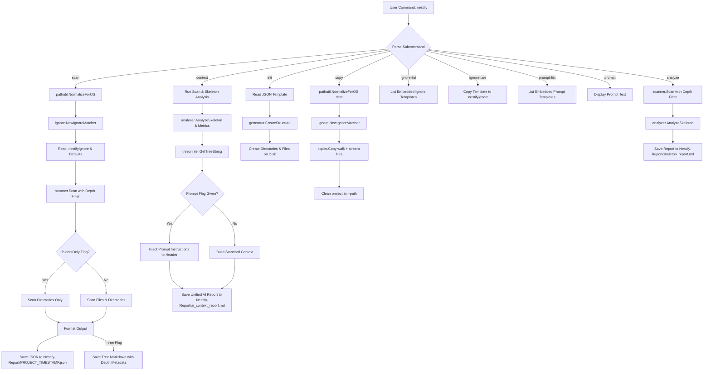

# Nestify

<p align="center">
  
  
  
  
</p>


 **نستی‌فای**  یک ابزار خط فرمان (CLI) سریع، سبک و چندپلتفرمی است که با زبان Go نوشته شده و به توسعه‌دهندگان کمک می‌کند ساختار پوشه‌های پروژه را به‌راحتی **اسکن**، **تحلیل**، **زمینه‌سازی برای AI**، **داربست‌بندی** و **کپی تمیز** کنند.

چه با پروژه‌های Go، .NET، Node.js، Python، Flutter، React یا Unity کار کنید، Nestify شفافیت و استانداردسازی را به جریان کاری توسعه شما می‌آورد.

📚 مستندات کامل: [https://badboy1981.github.io/Nestify/](https://badboy1981.github.io/Nestify/)

---

## ❓ چرا Nestify؟

ابزارهای امروزی توسعه‌دهندگان در حال سنگین‌تر شدن، وابسته شدن به فضای ابری و تهاجمی‌تر شدن هستند. Nestify مسیر معکوسی را در پیش گرفته است — یک جعبه‌ابزار سریع، خصوصی و آفلاین (Offline-first) برای تحلیل پروژه و زمینه‌سازی برای هوش مصنوعی.

- 🔒 **۱۰۰٪ محلی و خصوصی:** کاملاً روی سیستم شما اجرا می‌شود و هیچ‌گونه تلمتری یا ارسال داده‌ای ندارد. سورس‌کد شما هرگز از سیستمتان خارج نمی‌شود.
- ⚡ **سریع و فایل اجرایی تک‌فایلی:** با Go نوشته شده و به یک فایل اجرایی نیتیو کامپایل می‌شود. بدون نیاز به Node.js، Python یا runtimeهای جانبی.
- 🧠 **گزارش‌های بهینه برای مصرف توکن AI:** نویز ساخت (`bin/`، `obj/`، `node_modules/`) را حذف می‌کند تا فقط زمینه معماری معنادار را به LLM بفرستید.
- 💬 **قالب‌های پرامپت تزریقی:** دستورالعمل‌های هدفمند (معماری، بازآرایی، امنیت و …) را مستقیم به گزارش context اضافه کنید.
- 📏 **کنترل عمق پیمایش (`--depth` / `-d`):** عمق اسکن را محدود کنید تا روی معماری سطح بالا تمرکز بماند.
- 🔄 **چرخه کامل معماری:** اسکن ← تحلیل ← نقشه JSON ← ساخت مجدد با `init`، یا **کپی تمیز واقعی** با `copy`.

---

## 🌟 ویژگی‌های کلیدی

- 🌍 **اجرای سراسری (Global)** — یک‌بار نصب کنید و از هر پوشه‌ای اجرا کنید.
- 📦 **قالب‌های تعبیه‌شده** — ignore، project و prompt از طریق `embed` داخل باینری هستند.
- 💬 **یکپارچگی Prompt Engineering (`-p` / `--prompt`)** — قالب آماده یا متن سفارشی در گزارش AI.
- 📏 **کنترل عمق (`-d` / `--depth`)** — محدود کردن عمق پیمایش پوشه‌ها.
- 🔍 **اسکن هوشمند** — خروجی JSON و درخت Markdown.
- 📂 **خروجی منظم** — گزارش‌ها در `Nestify-Report/`.
- 📁 **حالت فقط-پوشه (`--folders-only`)** — تمرکز روی سلسله‌مراتب پوشه‌ها.
- 🚫 **قالب‌های ignore داخلی** — `ignore-list` و `ignore-use`.
- 🧠 **تحلیل اسکلت (`analyze`)** — متریک‌ها و تفکیک زبان‌ها.
- 🏗️ **تولید پروژه (`init`)** — ساخت ساختار از قالب JSON.
- 📋 **کپی تمیز پروژه (`copy`)** — کپی واقعی فایل‌ها با احترام به `.nestifyignore`.

---

## 🔄 جریان کاری و معماری برنامه


```mermaid
graph TD
    A[User Command: nestify] --> B{Parse Subcommand}

    B -->|scan| C[pathutil.NormalizeForOS]
    C --> D[ignore.NewIgnoreMatcher]
    D --> E[Read .nestifyignore & Defaults]
    E --> F[scanner.Scan with Depth Filter]
    F --> G{foldersOnly Flag?}
    G -->|Yes| H[Scan Directories Only]
    G -->|No| I[Scan Files & Directories]
    H --> J[Format Output]
    I --> J
    J --> K[Save JSON to Nestify-Report/PROJECT_TIMESTAMP.json]
    J -->|--tree Flag| L[Save Tree Markdown with Depth Metadata]

    B -->|context| M[Run Scan & Skeleton Analysis]
    M --> N[analyzer.AnalyzeSkeleton & Metrics]
    N --> O[treeprinter.GetTreeString]
    O --> P{Prompt Flag Given?}
    P -->|Yes| Q[Inject Prompt Instructions to Header]
    P -->|No| R[Build Standard Context]
    Q --> S[Save Unified AI Report to Nestify-Report/ai_context_report.md]
    R --> S

    B -->|init| T[Read JSON Template]
    T --> U[generator.CreateStructure]
    U --> V[Create Directories & Files on Disk]

    B -->|copy| CA[pathutil.NormalizeForOS dest]
    CA --> CB[ignore.NewIgnoreMatcher]
    CB --> CC[copier.Copy walk + stream files]
    CC --> CD[Clean project at --path]

    B -->|ignore-list| W[List Embedded Ignore Templates]
    B -->|ignore-use| X[Copy Template to .nestifyignore]

    B -->|prompt-list| Y[List Embedded Prompt Templates]
    B -->|prompt| Z[Display Prompt Text]

    B -->|analyze| AA[scanner.Scan with Depth Filter]
    AA --> AB[analyzer.AnalyzeSkeleton]
    AB --> AC[Save Report to Nestify-Report/skeleton_report.md]
```

---

## ⚙️ نحوه نصب

### نصب سراسری (پیشنهادی)

**Go 1.16+**  (پروژه با Go جدیدتر هم سازگار است) را نصب داشته باشید.

#### روش سریع

```bash
go install github.com/badboy1981/Nestify/cmd/nestify@latest
```

#### از روی سورس

```bash
git clone https://github.com/badboy1981/Nestify.git
cd Nestify
go install ./cmd/nestify
```

> 💡 مسیر `GOPATH/bin` باید در `PATH` سیستم باشد.

مستندات نصب و Releases: [Installation](https://badboy1981.github.io/Nestify/getting-started/installation/)

---

## 🚀 نحوه استفاده و دستورات

دستورات را می‌توانید از **هر پوشه کاری** اجرا کنید.

### ۱. زمینه AI (`context`)

گزارش یکپارچه Markdown در `Nestify-Report/ai_context_report.md` (متریک + زبان‌ها + درخت + پرامپت اختیاری).

```bash
nestify context [options]
```

| پرچم | توضیح |
|------|--------|
| `-p, --prompt` | نام قالب (مثل `architecture`) یا متن سفارشی |
| `-d, --depth` | محدودیت عمق (پیش‌فرض: نامحدود) |
| `--path` | مسیر پروژه (پیش‌فرض: `.`) |

```bash
nestify context -p architecture -d 2
nestify context -p "بررسی این ساختار برای معماری تمیز Go"
```

### ۲. اسکن پروژه (`scan`)

```bash
nestify scan [options]
```

| پرچم | توضیح |
|------|--------|
| `--path` | مسیر هدف |
| `--tree` | خروجی درخت Markdown |
| `--folders-only` | فقط پوشه‌ها |
| `-d, --depth` | محدودیت عمق |

```bash
nestify scan --tree -d 2
nestify scan --folders-only -d 1
```

### ۳. مدیریت ignore (`ignore-list` / `ignore-use`)

```bash
nestify ignore-list
nestify ignore-use go
```

### ۴. تحلیل (`analyze`)

```bash
nestify analyze
nestify analyze --path ./MyProject -d 3
```

خروجی: `Nestify-Report/skeleton_report.md`

### ۵. پرامپت‌ها (`prompt-list` / `prompt`)

```bash
nestify prompt-list
nestify prompt architecture
```

### ۶. ساخت از قالب (`init`)

اسکلت فیزیکی از JSON (محتوای خالی یا با `content` در قالب):

```bash
nestify init --template templates-projects/go_standard.json --path ./MyNewApp
```

### ۷. کپی تمیز پروژه (`copy`)

کپی **واقعی** فایل‌ها و پوشه‌های پروژهٔ فعلی به مقصد، با فیلتر `.nestifyignore`.  
مبدأ همیشه پوشه جاری است؛ مقصد با `--path` مشخص می‌شود.

```bash
# داخل پروژه مبدأ
nestify ignore-use go
nestify copy --path ../clean-project
```

برخلاف `init` (اسکلت از JSON)، دستور `copy` محتوای واقعی فایل‌ها (متن و باینری) را منتقل می‌کند.

---

## 🛠️ افزودن قالب‌های سفارشی

افزودن قالب ignore یا prompt پویا است و نیازی به تغییر کد ندارد:

1. فایل `.txt` را در `templates-ignore/` یا `templates-prompts/` بگذارید.
2. دوباره نصب کنید:

```bash
go install ./cmd/nestify
```

3. نام جدید در `ignore-list` یا `prompt-list` ظاهر می‌شود.

---

## 🔄 استفاده مجدد از معماری پروژه‌ها

### گزینه A — فقط ساختار خالی (`scan` + `init`)

```bash
nestify scan --path ./ExistingProject --folders-only
nestify init --template Nestify-Report/ExistingProject_TIMESTAMP.json --path ./NewProject
```

### گزینه B — کپی تمیز واقعی (`ignore-use` + `copy`)

```bash
# داخل پروژه مبدأ
nestify ignore-use go
# در صورت نیاز .nestifyignore را ویرایش کنید
nestify copy --path ../NewCleanProject
```

---

## 🏛️ معماری سورس‌کد

| پوشه / پکیج | مسئولیت |
| --- | --- |
| `embed.go` | `RootTemplatesFS` برای قالب‌های embed |
| `cmd/nestify/` | نقطه ورود (`main.go`) |
| `internal/cli/` | پارس CLI و ساب‌کامندها |
| `internal/scanner/` | پیمایش پوشه و درخت `Node` |
| `internal/ignore/` | `.nestifyignore` و لیست قالب‌ها |
| `internal/generator/` | ساخت ساختار از JSON (`init`) |
| `internal/copier/` | کپی streaming با فیلتر ignore (`copy`) |
| `internal/analyzer/` | متریک‌ها و تفکیک زبان‌ها |
| `internal/pathutil/` | نرمال‌سازی مسیر چندپلتفرمی |
| `internal/treeprinter/` | درخت ASCII |
| `internal/types/` | `Node` و `Template` |
| `templates-ignore/` | قالب‌های ignore |
| `templates-projects/` | قالب‌های اسکلت پروژه |
| `templates-prompts/` | قالب‌های پرامپت AI |

جزئیات بیشتر: [Architecture](https://badboy1981.github.io/Nestify/architecture/) و [Contributing](https://github.com/badboy1981/Nestify/blob/main/CONTRIBUTING.md)

---

## 💻 جدول خلاصه دستورات CLI

| دستور | توضیحات | مثال |
| --- | --- | --- |
| `nestify context` | گزارش یکپارچه آماده برای AI | `nestify context -p architecture -d 2` |
| `nestify analyze` | متریک و تفکیک زبان‌ها | `nestify analyze` |
| `nestify scan` | اسکن JSON / درخت Markdown | `nestify scan --tree -d 2` |
| `nestify init` | اسکلت از قالب JSON | `nestify init --template Blueprint.json --path ./App` |
| `nestify copy` | کپی تمیز پروژه فعلی به مقصد | `nestify copy --path ../clean-app` |
| `nestify ignore-use` | اعمال قالب ignore | `nestify ignore-use go` |
| `nestify ignore-list` | لیست قالب‌های ignore | `nestify ignore-list` |
| `nestify prompt-list` | لیست پرامپت‌های embed | `nestify prompt-list` |
| `nestify prompt` | نمایش متن یک پرامپت | `nestify prompt security` |

---

## 💡 سناریوهای کاربردی

### ۱. جریان روزانه

```bash
cd ./MyProject
nestify ignore-use go
nestify scan --tree -d 2
nestify analyze
nestify context -p architecture -d 2
```

### ۲. زمینه برای LLM

```bash
nestify ignore-use nodejs
nestify context -p refactor -d 3
# فایل: Nestify-Report/ai_context_report.md
```

### ۳. کلون تمیز از یک ریپوی موجود

```bash
cd ./SomeOpenSourceRepo
nestify ignore-use go
nestify copy --path ../MyCleanClone
```

### ۴. اسکلت خالی از روی ساختار

```bash
nestify scan --folders-only
nestify init --template Nestify-Report/....json --path ./EmptySkeleton
```

---

## 🤝 مشارکت

برای افزودن قابلیت جدید، معمولاً یک پکیج در `internal/`، یک handler در `cli`، ثبت در `cli.go` و به‌روزرسانی `help.go` کافی است.

راهنمای کامل: [CONTRIBUTING.md](https://github.com/badboy1981/Nestify/blob/main/CONTRIBUTING.md)

---

## 📄 مجوز و اعتبار

این پروژه تحت مجوز **Apache License 2.0** منتشر شده است. جزئیات در فایل [LICENSE](https://github.com/badboy1981/Nestify/blob/main/LICENSE).

حق نشر © ۲۰۲۶ **[badboy1981](https://github.com/badboy1981)**
