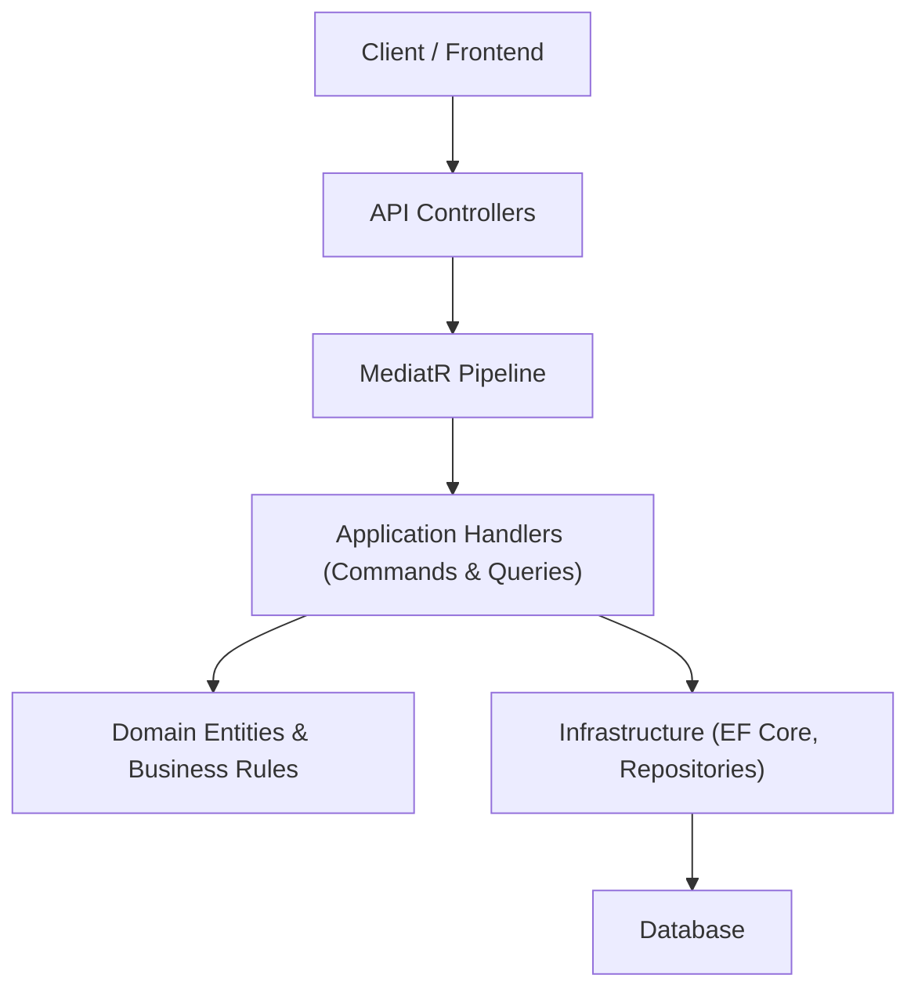

# 📚 ConsoleStore: فروشگاه آنلاین تجهیزات کنسول بازی با Clean Architecture & CQRS

[](https://opensource.org/licenses/MIT)
[](https://dotnet.microsoft.com/)

یک باک‌اند **E-commerce** مقیاس‌پذیر و قابل نگهداری برای فروشگاه آنلاین تجهیزات کنسول بازی (PS5، Xbox، Nintendo Switch، بازی‌ها و لوازم جانبی) که بر اساس اصول **Clean Architecture** و **CQRS** با MediatR در بستر **ASP.NET Core** پیاده‌سازی شده است.

این پروژه یک نمونه حرفه‌ای و مدرن از توسعه .NET است که تمرکز اصلی آن بر جداسازی دغدغه‌ها، تست‌پذیری بالا، خوانایی کد و استفاده از بهترین الگوهای صنعتی است.

## 🚀 تکنولوژی‌ها و الگوهای کلیدی

| حوزه                | تکنولوژی / الگو                              | هدف و مزیت                                                                 |
|---------------------|-----------------------------------------------|-----------------------------------------------------------------------------|
| **معماری**         | **Clean Architecture**                        | سازماندهی لایه‌های مستقل (`Domain`, `Application`, `Infrastructure`, `API`) برای کاهش وابستگی |
| **الگوی طراحی**    | **CQRS + MediatR**                            | تفکیک خواندن (Queries) از نوشتن (Commands) برای عملکرد بهتر و سازماندهی تمیزتر |
| **Pipeline**        | **MediatR Behaviors**                         | اجرای خودکار Validation، Logging و سایر وظایف قبل از Handlerها            |
| **اعتبارسنجی**     | **FluentValidation**                          | قوانین اعتبارسنجی خوانا و قوی                                              |
| **نگاشت شیء**      | **AutoMapper**                                | نگاشت آسان بین Domain Entityها و DTOها                                     |
| **دیتابیس**        | **Entity Framework Core + SQL Server**        | ORM قدرتمند با پشتیبانی کامل از Migrationها                                 |
| **API Documentation**| **Swashbuckle (Swagger)**                     | تست آسان Endpointها                                                        |
| **Framework**       | **ASP.NET Core Web API**                      | بستر اصلی سرویس‌های RESTful                                                |

## 🏗️ ساختار معماری (Layer Breakdown)



پروژه به لایه‌های مستقل زیر تقسیم شده است:

1. Domain → هسته خالص پروژه: Entityها (Product, Category)، Interfaceهای Repository و قوانین کسب‌وکار بدون هیچ وابستگی خارجی.
2. Application → منطق کسب‌وکار: Commands, Queries, Handlers, DTOها، Validation Behaviors و Mapping.
3. Infrastructure → پیاده‌سازی‌های فنی: EF Core DbContext، Repositoryها، Migrationها.
4. API → لایه ورودی: Controllerها، Dependency Injection، Middlewareهای سفارشی.

✅ ویژگی‌های پیاده‌سازی شده

CRUD کامل محصولات
CQRS با MediatR و Pipeline Behaviors (Validation خودکار)
مدیریت خطاهای سفارشی (Custom Exception Middleware)
Swagger UI برای تست API
ساختار آماده برای گسترش (سبد خرید، سفارش، احراز هویت)

🔜 در حال توسعه / Roadmap

سبد خرید و مدیریت سفارشات
احراز هویت و مجوزدهی (JWT + ASP.NET Core Identity)
پنل مدیریت با Blazor
آپلود تصویر محصولات
پرداخت آنلاین
Caching و جستجوی پیشرفته

⚙️ راه‌اندازی پروژه
پیش‌نیازها

.NET SDK 10.0 (یا بالاتر)
Visual Studio 2022/2025 یا VS Code

دستورالعمل‌ها

Clone مخزنBashgit clone https://github.com/[نام-کاربری]/ConsoleStore.git
cd ConsoleStore
اجرای APIBashdotnet run --project API/API.csprojپس از اجرا، Swagger UI به صورت خودکار در https://localhost:7xxx/swagger باز می‌شود.
اعمال Migrationها (در صورت نیاز)Bashdotnet ef database update --project Infrastructure

🔑 نمونه Endpointهای کلیدی (Product)


متدمسیرتوضیحاتمثال درخواست (cURL)GET/api/productsدریافت لیست محصولاتcurl https://localhost:7xxx/api/productsPOST/api/productsایجاد محصول جدید (با Validation خودکار)```bashcurl -X POST https://localhost:7xxx/api/products \-H "Content-Type: application/json" \-d '{"name":"PS5 Slim","price":25000000,"stock":10,"categoryId":1}'
language-|## 🛡️ مدیریت سفارشی خطاها
یک **Custom Exception Middleware** در لایه API پیاده‌سازی شده تا پاسخ‌های استاندارد و قابل پیش‌بینی ارائه دهد:

- `ValidationException` → **400 Bad Request**
- `NotFoundException` → **404 Not Found**
- سایر خطاها → **500 Internal Server Error** (با لاگ‌برداری)
