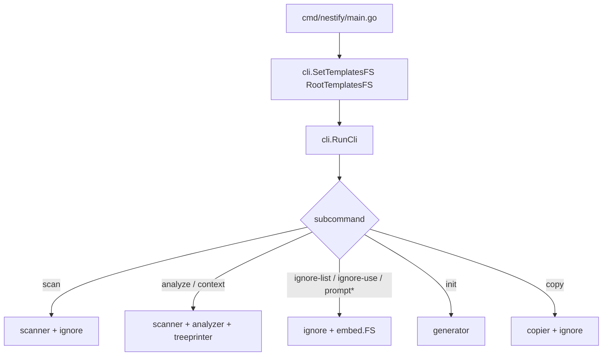

# 🏛️ Codebase Architecture & Internal Design

Nestify is a small Go module (`github.com/badboy1981/Nestify`) compiled to one executable.  
Commands are dispatched from a thin CLI layer into focused internal packages.

---

## 📁 Repository layout

```text
Nestify/
├── cmd/nestify/main.go          # Process entrypoint
├── embed.go                     # RootTemplatesFS (ignore / projects / prompts)
├── go.mod
├── internal/
│   ├── cli/                     # Flag parsing, user messages, command handlers
│   ├── scanner/                 # Directory walk → types.Node tree
│   ├── ignore/                  # IgnoreMatcher + template listing from embed.FS
│   ├── analyzer/                # Metrics & language breakdown
│   ├── treeprinter/             # ASCII tree strings
│   ├── generator/               # init: create folders/files from Node tree
│   ├── copier/                  # copy: stream files respecting ignore rules
│   ├── pathutil/                # OS path normalize + slash helpers
│   └── types/                   # Node, Template structs
├── templates-ignore/            # Embedded *.txt presets
├── templates-projects/          # Embedded *.json scaffolds
└── templates-prompts/           # Embedded prompt *.txt files
```

---

## 🚀 Startup flow



1. **`main`** injects the embedded template filesystem into `cli`.
2. **`RunCli`** switches on `os.Args[1]` (`scan`, `context`, `copy`, …).
3. Each handler normalizes paths with `pathutil`, then calls the matching internal package.

---

## 📦 Package responsibilities

| Package | Role |
|---------|------|
| **`cli`** | Subcommands, flags, help/version, report file paths under `Nestify-Report/` |
| **`scanner`** | Recursive walk with optional `--depth` and `--folders-only`; builds `[]types.Node` |
| **`ignore`** | Loads `.nestifyignore` (+ built-in defaults); `ShouldIgnore`; lists templates from `embed.FS` |
| **`analyzer`** | File/folder counts, size, language stats → Markdown report body |
| **`treeprinter`** | Renders a `Node` as an ASCII tree string |
| **`generator`** | `init`: materializes folders/files (optional `Content`) from JSON nodes |
| **`copier`** | `copy`: walk source (cwd), stream file bytes to `--path`, same ignore rules |
| **`pathutil`** | `NormalizeForOS`, `ToStandardPath` for cross-platform paths |
| **`types`** | Shared `Node` and `Template` models |

---

## 🧱 Core data model

```go
// internal/types — simplified
type Node struct {
    Name     string
    Type     string // "folder" | "file"
    Content  string // used by init when present
    Size     int64
    Children []Node
}

type Template struct {
    ProjectType string
    Language    string
    Tags        []string
    Root        []Node
}
```

- **`scan`** produces node trees (structure + sizes, not full file text).  
- **`init`** consumes JSON → `generator.CreateStructure`.  
- **`copy`** does not go through `Node` content; it streams real files via `io.Copy`.

---

## 🚫 Ignore pipeline

Shared by `scan`, `analyze`, `context`, and `copy`:

1. `ignore.NewIgnoreMatcher(target)`
2. Patterns from cwd `.nestifyignore` (and target’s file if different)
3. Built-in defaults (e.g. `.git`, `node_modules`)
4. `ShouldIgnore(name)` / `ShouldIgnore(relativePath)` during walk

`ignore-use` only writes a preset from `templates-ignore/` onto disk as `.nestifyignore`.

---

## 📋 Command → code map

| Command | Primary handlers / packages |
|---------|-----------------------------|
| `scan` | `cli/scan.go` → `scanner` → optional `treeprinter` |
| `analyze` | `cli/analyze_handler.go` → `scanner` + `analyzer` |
| `context` | `cli/context_handler.go` → `scanner` + `analyzer` + `treeprinter` + prompt helper |
| `ignore-list` / `ignore-use` | `cli/ignore_handler.go` → `ignore` + `templatesFS` |
| `prompt-list` / `prompt` | `cli/prompt_handler.go` → `templatesFS` |
| `init` | `cli/init.go` → `generator` |
| `copy` | `cli/copy.go` → `copier` → `ignore` |
| `--version` | `cli/version.go` |

---

## 📦 Embedded templates

```go
// embed.go
//go:embed templates-ignore templates-projects templates-prompts
var RootTemplatesFS embed.FS
```

- Discovered **by filename** at runtime (no hard-coded name lists for ignore/prompt).
- Adding a new `.txt` / keeping JSON under those folders + `go install` embeds them into the next binary.

---

## 🔐 Design constraints

- **No network** in core command paths  
- **Single static-friendly binary** (typical `CGO_ENABLED=0` style Go CLI)  
- **Cross-platform paths** centralized in `pathutil`  
- **CLI messages** and comments in English for a consistent upstream codebase  

---

## ➡️ Related docs

- [Commands overview](commands/overview.md)  
- [Clean copy](commands/copy.md)  
- [Templates overview](template/overview.md)  
- [AI context](ai/overview.md)  
