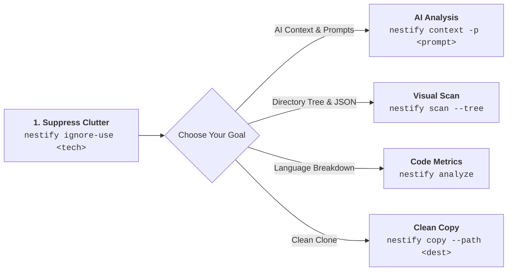

# 🛠️ CLI Commands Overview

**Nestify** provides a suite of fast, token-efficient, and cross-platform command-line tools designed to streamline project structure scanning, codebase analysis, AI context generation, and project scaffolding.

All commands execute locally with zero network telemetry and share consistent syntax across Windows, macOS, and Linux.

---

## 🧭 Command Matrix at a Glance

| Command | Primary Use Case | Output Location | Key Flags |
| --- | --- | --- | --- |
| [`nestify scan`](scan.md) | Structural scanning to JSON node tree or Markdown tree. | `Nestify-Report/` | `--tree`, `-d`, `--folders-only` |
| [`nestify ignore-list`](ignore.md) | Discover embedded tech-stack ignore presets. | Terminal Output | N/A |
| [`nestify ignore-use`](ignore.md) | Generate a local `.nestifyignore` file for noise reduction. | `.nestifyignore` | `<template-name>` |
| [`nestify analyze`](analyze.md) | Calculate language distribution percentages and project size metrics. | `skeleton_report.md` | `-d`, `--path` |
| [`nestify context`](context.md) | Generate a unified AI-ready Markdown context report with optional prompt injection. | `ai_context_report.md` | `-p`, `-d`, `--path` |
| [`nestify prompt-list`](prompt.md) | Discover built-in prompt engineering templates. | Terminal Output | N/A |
| [`nestify prompt`](prompt.md) | Inspect the full instruction text of an embedded prompt. | Terminal Output | `<template-name>` |
| [`nestify init`](init.md) | Scaffold empty physical directory/file structures from JSON blueprints. | Target Path | `--template`, `--path` |
| [`nestify copy`](copy.md) | Copy current project to a new path with real file contents (respects `.nestifyignore`). | Destination path | `--path` |

---

## ⚡ Recommended Workflow Sequence

To get the most out of Nestify, follow this standard execution order:

1. **Suppress Clutter First:** Run `nestify ignore-use <tech-stack>` to filter out compiled binaries, dependencies, and temporary files (`bin/`, `obj/`, `node_modules/`).

2. **Contextualize for AI:** Run `nestify context -p <template>` to generate a complete codebase context report merged with custom LLM task instructions.

3. **Inspect Architecture:** Run `nestify scan --tree -d 2` to review high-level directory organization without drowning in file details.

4. **Clean Clone (optional):** Run `nestify copy --path ../clean-project` to copy the filtered project (real files + folders) to a new location.

---

## 🌐 Cross-Platform Parity

Nestify is compiled into a single native binary using Go. It requires no external runtime dependencies (Node.js, Python, or .NET).

!!! info "Terminal & Shell Support"
     All syntax, flags, and outputs function identically across **Windows (PowerShell, Command Prompt)**, **macOS (Terminal, iTerm)**, and **Linux (Bash, Zsh)**. File paths are automatically normalized across OS-specific separators (`/` vs `\`).