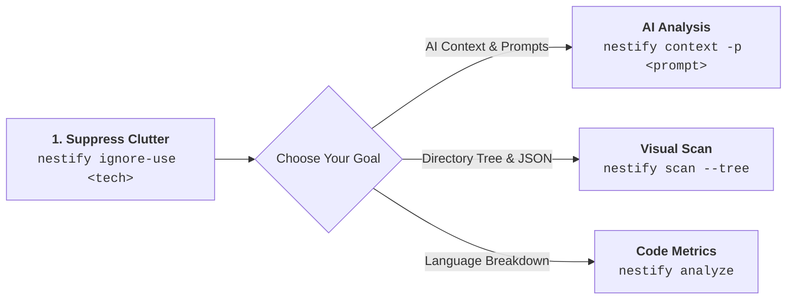

# 🛠️ CLI Commands Overview

**Nestify** provides a suite of fast, token-efficient, and cross-platform command-line tools designed to streamline project structure scanning, codebase analysis, AI context generation, and project scaffolding[cite: 5].

All commands execute locally with zero network telemetry and share consistent syntax across Windows, macOS, and Linux[cite: 5].

---

## 🧭 Command Matrix at a Glance

| Command | Primary Use Case | Output Location | Key Flags |
| --- | --- | --- | --- |
| [`nestify scan`](scan.md) | Structural scanning to JSON node tree or Markdown tree[cite: 5]. | `Nestify-Report/`[cite: 5] | `--tree`, `-d`, `--folders-only`[cite: 5] |
| [`nestify ignore-list`](ignore.md) | Discover embedded tech-stack ignore presets[cite: 5]. | Terminal Output[cite: 5] | N/A |
| [`nestify ignore-use`](ignore.md) | Generate a local `.nestifyignore` file for noise reduction[cite: 5]. | `.nestifyignore`[cite: 5] | `<template-name>`[cite: 5] |
| [`nestify analyze`](analyze.md) | Calculate language distribution percentages and project size metrics[cite: 5]. | `skeleton_report.md`[cite: 3, 5] | `-d`, `--path`[cite: 5] |
| [`nestify context`](context.md) | Generate a unified AI-ready Markdown context report with optional prompt injection[cite: 5]. | `ai_context_report.md`[cite: 4, 5] | `-p`, `-d`, `--path`[cite: 5] |
| [`nestify prompt-list`](prompt.md) | Discover built-in prompt engineering templates[cite: 5]. | Terminal Output[cite: 5] | N/A |
| [`nestify prompt`](prompt.md) | Inspect the full instruction text of an embedded prompt[cite: 5]. | Terminal Output[cite: 5] | `<template-name>`[cite: 5] |
| [`nestify init`](init.md) | Scaffold empty physical directory/file structures from JSON blueprints[cite: 5]. | Target Path[cite: 5] | `--template`, `--path`[cite: 5] |

---

## ⚡ Recommended Workflow Sequence

To get the most out of Nestify, follow this standard execution order:

1. **Suppress Clutter First:** Run `nestify ignore-use <tech-stack>` to filter out compiled binaries, dependencies, and temporary files (`bin/`, `obj/`, `node_modules/`).

2. **Contextualize for AI:** Run `nestify context -p <template>` to generate a complete codebase context report merged with custom LLM task instructions.

3. **Inspect Architecture:** Run `nestify scan --tree -d 2` to review high-level directory organization without drowning in file details.

---

## 🌐 Cross-Platform Parity

Nestify is compiled into a single native binary using Go. It requires no external runtime dependencies (Node.js, Python, or .NET).

!!! info "Terminal & Shell Support"
     All syntax, flags, and outputs function identically across **Windows (PowerShell, Command Prompt)**, **macOS (Terminal, iTerm)**, and **Linux (Bash, Zsh)**. File paths are automatically normalized across OS-specific separators (`/` vs `\`).